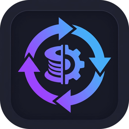

<p align="center">
  
</p>

<h1 align="center">🔄 Slicer Profile Converter</h1>

<p align="center">
  Move your <b>filament</b>, <b>printer</b> and <b>process</b> profiles between
  <b>Bambu Studio</b>, <b>OrcaSlicer</b> and <b>Snapmaker Orca</b> —
  read straight from disk, <i>no fiddly export button required</i>.
</p>

<p align="center">
  
  
  
  
</p>

---

## 😖 The problem this solves

If you run **more than one slicer** — say two Bambu printers in Bambu Studio and
a Snapmaker on Snapmaker Orca — you've probably hit these walls:

- **Bambu Studio's export is a maze.** The *Export Preset Bundle* dialog only
  lists profiles you saved as "User Presets" **and** that match your currently
  selected printer/nozzle — so the list is often mysteriously **empty**.
- **Copying JSON by hand breaks profiles.** Profiles *inherit* from a parent;
  move just the child and it **vanishes** in the other slicer because the parent
  is missing.
- **Profiles are "locked" to a printer.** A filament profile tied to a Bambu P1S
  won't show up for your Snapmaker.

**Slicer Profile Converter** fixes all three. It reads the profile `.json` files
**directly from where each slicer stores them on disk**, flattens the
inheritance chain into a self-contained copy, re-targets it to the printer you
choose, and writes a ready-to-use profile — with a plain-English report of
everything it changed.

---

## ✨ Features

- 🔎 **Auto-detects** Bambu Studio, OrcaSlicer and Snapmaker Orca installs and
  finds their profile folders for you.
- 💾 **Reads profiles straight from disk** — no need to get Bambu's export to work.
- 🧬 **Flattens inheritance** so a converted profile is self-contained and won't
  disappear in the target slicer.
- 🎯 **Re-targets to any printer** — pick the destination printer name and the
  profile becomes compatible with it.
- 📦 **All three profile types** — filament, printer (machine) and process/print.
- 📝 **Conversion report** — see exactly what changed and what (if anything)
  needs your review.
- 🧰 **Manual mode** — point it at any `.json` (from a backup or another PC) even
  if that slicer isn't installed here.
- 🪶 **Zero dependencies** — pure Python + Tkinter. No pip install headaches.

---

## 📥 Download

Grab a ready-to-run build from the [**Releases**](../../releases) page — no Python needed:

- **Windows** → run the installer `SlicerProfileConverter-Setup.exe` (adds a
  desktop icon + Start Menu shortcut + uninstaller), or grab the portable `.exe`.
- **macOS** → `SlicerProfileConverter-macos`
- **Linux** → `SlicerProfileConverter-linux`

---

## 🚀 Usage

1. **From:** choose the slicer your profiles are currently in (e.g. Bambu Studio).
2. **Profile type:** Filament, Printer, or Process.
3. Pick one or more profiles from the list (they're read from disk automatically).
4. **To:** choose the destination slicer (e.g. Snapmaker Orca).
5. **Target printer:** type the exact printer name as it appears in the
   destination slicer (e.g. `Snapmaker Artisan 0.4 nozzle`).
6. Click **Convert** and choose an output folder.
7. Read the report, then import the resulting `.json` into your slicer via
   **File → Import → Import Configs**, or drop it straight into the slicer's
   user folder.

> 💡 **Tip:** For filament/process profiles, the "Target printer" name must match
> a printer that already exists in the destination slicer, or the profile won't
> show up. Copy the name from the printer dropdown in that slicer.

---

## 🧠 How it works

All three slicers are forks of the same engine, so they share a JSON profile
schema with an `inherits` field. Conversion is therefore mostly about making a
profile **portable** and **re-targeted**:

| Step | What happens |
|------|--------------|
| **1. Flatten** | The `inherits` chain is resolved by reading parent profiles from the source's user + system folders, merging them (child settings win). |
| **2. Re-target** | `compatible_printers` is rewritten to your chosen printer; the compatibility condition is cleared. |
| **3. Re-identify** | The profile is renamed (`… (from Bambu Studio)`), marked as a user preset, and source-only IDs are dropped so it doesn't clash. |
| **4. G-code** | If crossing to/from the PrusaSlicer dialect, `[var]` ↔ `{var[0]}` template variables are translated. |
| **5. Report** | Every change is logged, plus warnings for anything to double-check (missing parents, machine geometry, unknown G-code vars). |

Where profiles live on disk (the folders the app scans):

| OS | Path |
|----|------|
| Windows | `%AppData%\Roaming\<Slicer>\user\<id>\{filament,machine,process}\` |
| macOS | `~/Library/Application Support/<Slicer>/user/<id>/…` |
| Linux | `~/.config/<Slicer>/user/<id>/…` |

---

## 🛠️ Run from source

```bash
git clone https://github.com/Netspecs/slicer-profile-converter.git
cd slicer-profile-converter
python3 app.py
```

Linux users may need Tkinter: `sudo apt install python3-tk`.

### Run the tests

```bash
python3 test_converter.py
```

---

## ⚠️ Notes & limitations

- Bambu ↔ Orca ↔ Snapmaker conversions are high-fidelity (same schema family).
- PrusaSlicer/SuperSlicer `.ini` support is **basic** (G-code + common keys);
  full `.ini` mapping is on the roadmap.
- Always keep a backup of your original profiles. Converted profiles are written
  to a folder **you** choose — the app never overwrites your originals.

---

## 📄 License

[MIT](LICENSE) © 2026 Netspecs
